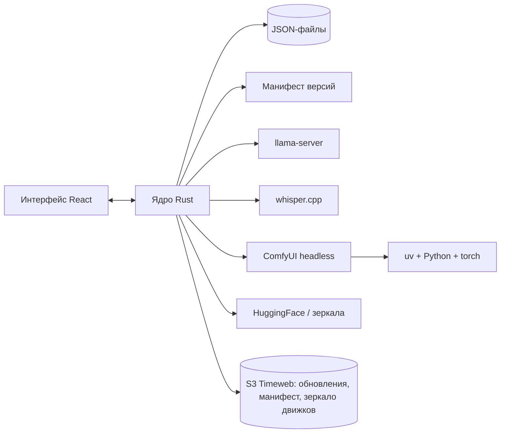

# План: от нуля до версии 1.0

Цель 1.0: **Ollivo** — программа для Windows + NVIDIA, которую ставит человек без технических знаний.
Внутри: чат с локальными моделями, голос, файлы, картинки, видео и звук, простой режим и режим «Профи».

Оценки сроков даны для одного разработчика вместе с Claude. Это ориентир, а не обещание.

## Стек
| Часть | Что берём | Почему |
|---|---|---|
| Оболочка | Tauri 2 + React + TypeScript | Лёгкий установщик (~10 МБ против ~150 у Electron), нативное окно |
| Ядро | Rust (внутри Tauri) | Скачивание, манифест, запуск движков, проверка железа. Работает ещё до того, как появился Python |
| Хранилище | JSON-файлы (SQLite — если понадобится) | Чаты, библиотека моделей, настройки. Разговоров сотни, поиск перебором — 0,2 с на 23 МБ ([Фаза 2](phase-2.md)) |
| Текст и зрение | llama.cpp (`llama-server`), готовая сборка: Vulkan по умолчанию, CUDA — ускоритель по замеру ([Фаза 0](phase-0.md)) | Без Python, API как у OpenAI, стриминг |
| Картинки и видео | ComfyUI headless (через его API) | Поддерживает почти все модели, граф можно открыть в «Профи» |
| Голос в текст | whisper.cpp | Без Python, быстрый на CUDA |
| Текст в голос | Kokoro / Piper (решим в фазе 6) | Лёгкие, хорошее качество |
| Python-окружение | uv + встроенный Python 3.12 | Только для ComfyUI и того, что без Python не работает |
| Железо | NVML (крейт `nvml-wrapper`) | Модель видеокарты, видеопамять, версия драйвера |
| Установщик | NSIS через бандлер Tauri | Стандартно, без прав администратора |
| Обновления | Tauri updater + `latest.json` в S3 (Timeweb) | Как в ClipVault («Монетизация и релиз ClipVault» (личная заметка, вне репозитория)) |

**Смена решения:** раньше планировали Python-сайдкар на FastAPI как главный бэкенд.
Теперь главный бэкенд — Rust-ядро: логика установки не может жить в Python, которого ещё нет.
Python — лишь один из движков, и ставится он по требованию.

## Схема


## Обновления и распространение
Схема как в ClipVault и десктопе Призмы Права: всё лежит в S3 Timeweb, публичное чтение.
```
<bucket>/ollivo/
  updates/latest.json        версия, заметки, URL, подпись — заливается ПОСЛЕДНИМ
  updates/<ver>/…setup.exe   установщик + .sig
  manifest/engines.json      проверенные версии движков, URL, SHA256
  manifest/recipes.json      рецепты задач и каталог моделей
  mirror/…                   зеркало небольших движков (llama.cpp, whisper.cpp, uv, ffmpeg)
```
- **Программа:** Tauri updater проверяет `latest.json` при запуске и раз в сутки. Файлы подписаны ключом Tauri updater
  (бесплатно, не связано с SmartScreen): подменённое обновление программа не установит.
- **Движки и рецепты** обновляются отдельно от программы, через манифест. Новую модель или рецепт можно выпустить без релиза.
- **Зеркало движков** в S3 спасает, когда GitHub медленный или недоступен. torch (~3 ГБ) и модели не зеркалим — дорого по трафику;
  они идут с PyPI/PyTorch и HuggingFace, у HF — запасное зеркало.
- **Скрипт `npm run publish-update`:** сборка → подпись → заливка установщика → `latest.json` последним → обновление страницы загрузки.
- **Каналы:** `stable` и `beta` (отдельный `latest-beta.json`), бета-тестеры включают в настройках.
- Ключ подписи updater и ключи S3 хранятся вне репозитория; в заметках — только имена переменных.

### Без подписи кода (SmartScreen)
Сертификата пока нет, поэтому новичок увидит «Windows защитил ваш компьютер». Что делаем:
- На сайте рядом с кнопкой «Скачать» — картинка-инструкция: «Подробнее → Выполнить в любом случае». И в README.
- Публикуем SHA256 установщика; перед каждым релизом проверяем его на VirusTotal.
- Ложные срабатывания Defender отправляем в Microsoft через бесплатную форму проверки файлов.
- Не используем упаковщики exe: они сильно повышают риск ложных срабатываний.
- Обновления, которые скачивает сама программа, обычно проходят без окна SmartScreen: предупреждение появляется только при первой установке.
- Репутация у SmartScreen копится со скачиваниями, и со временем предупреждение может пропасть само.
- Дешёвые варианты на потом: если код открытый — SignPath Foundation (бесплатно для open source) или Certum Open Source (недорого).

## Фаза 0. Разведка рисков (1–2 недели)
Проверяем самое опасное до того, как писать интерфейс. Каждая проверка — маленький скрипт или прототип.
- [ ] Чистая виртуальная машина Windows 11, пользователь с **кириллическим именем**. Всё дальнейшее проверяем на ней.
- [x] `uv` сам ставит Python, venv и torch с CUDA. Замерить время и размер ([Фаза 0](phase-0.md): venv 5,2 ГБ, torch лучше качать своим загрузчиком).
- [x] `llama-server` из готовой сборки запускается и стримит ответ ([Фаза 0](phase-0.md): Vulkan — кандидат по умолчанию). Для GTX 10xx — сборка CUDA 12 (CUDA 13 не поддерживает Pascal).
- [x] ComfyUI из zip запускается headless и генерирует картинку по API (workflow в JSON).
- [x] Определение типа модели ([Фаза 0](phase-0.md)): чтение метаданных GGUF и заголовка safetensors (LLM / SD1.5 / SDXL / Flux / видео / Whisper / TTS).
- [x] Расчёт «пойдёт ли модель»: размер весов + контекст против видеопамяти (коэффициенты для картинок откалибровать на ComfyUI).
- [x] Выбрать название программы: **Ollivo**, сайт ollivo.ru.

**Готово, когда** все пункты проверены, а грабли записаны в [Установка](install.md).

## Фаза 1. Каркас и установка (3–4 недели)
- [ ] Проект Tauri + React, структура репозитория, CI на GitHub Actions (сборка установщика).
- [ ] Rust-ядро: менеджер загрузок (докачка, SHA256, повторы, зеркала, пауза).
- [ ] Манифест версий: JSON на GitHub Releases с URL, хешами и проверенными связками.
- [ ] Мастер первого запуска: проверка ПК, драйвера и VC++, выбор диска, путь без кириллицы.
- [ ] Экран установки по UX из [Установка](install.md): шаги, время словами, «Подробнее», пауза, трей, прогресс на панели задач.
- [ ] Менеджер процессов движков: запуск, остановка, проверка здоровья, логи в файл.
- [ ] Кнопка «Починить».
- [ ] Автообновление с первого дня: бакет в S3, ключ Tauri updater, скрипт `publish-update`, канал beta.
  Проверить цепочку «версия 0.0.1 → 0.0.2» на чистой машине.

**Готово, когда** на чистой машине установщик ставит программу, скачивает llama.cpp и показывает «Всё готово».

## Фаза 2. Чат с текстовыми моделями — MVP (4–5 недель)
- [x] Библиотека моделей: добавить файл (кнопка или перетаскивание), тип и светофор определяются сами.
- [x] Подхват моделей из папок LM Studio, Ollama и ComfyUI без копирования.
- [x] Каталог: подборка проверенных моделей + поиск по HuggingFace с фильтром «пойдёт на моём ПК», скачивание по ссылке.
- [x] Автонастройка запуска: сколько слоёв на видеокарту, размер контекста, выбор квантизации под память.
- [x] Чат: стриминг, markdown и код, остановка, перегенерация, история, поиск по чатам.
- [x] Пресеты вместо параметров: «Точнее ↔ Креативнее», роли (помощник, переводчик, программист).
- [ ] Понятные ошибки с кнопками действий.
- [x] Лицензия модели видна в карточке (некоторые модели запрещают коммерческое использование).

**Готово, когда** новичок сам ставит программу, находит модель и переписывается с ней. **→ Версия 0.1, закрытый тест на 5–10 людях.**

## Фаза 3. Голос и файлы (2–3 недели)
- [ ] Диктовка: кнопка микрофона → whisper.cpp → текст в поле ввода. Модель Whisper подбирается под железо.
- [ ] Вложения: картинки для моделей со зрением (mmproj подключается сам).
- [ ] Документы: PDF, DOCX, TXT, код → текст в контекст. Если документ длинный — предупредить. Поиск по большим документам (RAG) — в фазе 9.
- [ ] Аудиофайл → расшифровка.
- [ ] Если модель не умеет работать с этим файлом, объяснить и предложить подходящую.

**Готово, когда** можно надиктовать вопрос, приложить фото или PDF и получить ответ.

## Фаза 4. Картинки (4–6 недель)
- [ ] Установка по требованию: Python + torch + ComfyUI, с предупреждением о размере и экраном установки.
- [ ] Шаблоны workflow для семейств моделей (SD1.5, SDXL, Flux, SD3.5); выбираются сами по типу модели.
- [ ] Экран генерации в простом режиме: описание, размер, «Быстро ↔ Качественно», количество вариантов.
- [ ] Галерея: всё с параметрами, кнопки «повторить», «вариации», «доработать», «открыть папку».
- [ ] Картинка → картинка, дорисовка по маске.
- [ ] Очередь задач и уведомления.
- [ ] Безопасность: `.ckpt`/`.pt` могут содержать вредоносный код. Предупреждать и предлагать версию в safetensors.

**Готово, когда** новичок генерирует картинку, не зная слов «сэмплер» и «CFG». **→ Версия 0.5, открытая бета.**

## Фаза 5. Задачи и умный чат (3–4 недели)
- [ ] Главный экран с плитками задач: «Удалить фон», «Улучшить качество фото», «Расшифровать аудио», «Нарисовать», «Перевести документ» и т.д.
- [ ] Каждая задача — рецепт: какие модели нужны, какой workflow; всё скачивается само.
- [ ] Оркестратор в чате: текстовая модель вызывает инструменты («нарисуй…» → генерация картинки прямо в диалоге).
- [ ] Рецепты лежат в манифесте, новые добавляются без обновления программы.

**Готово, когда** задачу можно решить в один клик с главного экрана, а в чате можно попросить картинку.

## Фаза 6. Видео и звук (4–6 недель)
- [ ] Видео через ComfyUI: текст → видео и картинка → видео (Wan, LTX и подобные). Честная оценка времени до старта.
- [ ] Длинные задачи в фоне: очередь, прогресс, уведомление, отмена.
- [ ] Озвучка текста (TTS) и чтение ответов чата вслух.
- [ ] Голосовой режим «как звонок»: Whisper → модель → TTS.
- [ ] По возможности: генерация музыки и звуков.

**Готово, когда** можно сделать короткое видео из фото и поговорить с моделью голосом.

## Фаза 7. Режим «Профи» (3–4 недели)
- [ ] Переключатель режима в настройках; в простом режиме ничего лишнего не видно.
- [ ] Все параметры llama.cpp и генерации, свои аргументы запуска.
- [ ] Логи движков в реальном времени, встроенный терминал в окружении программы.
- [ ] Граф ComfyUI внутри программы, свои workflow, custom nodes, LoRA.
- [ ] Локальный API в стиле OpenAI для других программ.
- [ ] Управление версиями движков: откат, свои сборки.

**Готово, когда** опытный пользователь может заменить программой свой набор ComfyUI + LM Studio.

## Фаза 8. Полировка и релиз 1.0 (4–6 недель)
- [ ] Тесты на матрице железа: GTX 10xx/16xx, RTX 20xx–50xx, 4–24 ГБ видеопамяти, слабые ПК.
- [ ] Проверка на антивирусах и VirusTotal, инструкция про SmartScreen на сайте (подписи кода пока нет, см. выше).
- [ ] Обновление движков через манифест в S3 с откатом, если новая версия не запустилась.
- [ ] Отчёты о сбоях (только с согласия), страница «Сообщить о проблеме» с логами одной кнопкой.
- [ ] Языки интерфейса: русский и английский.
- [ ] Знакомство с программой при первом запуске, подсказки.
- [ ] Офлайн-установщик.
- [ ] Сайт ollivo.ru, документация, видео-демо.

**Готово, когда** на 20+ разных ПК установка проходит без помощи. **→ Версия 1.0.**

## После 1.0
- AMD (ROCm/Vulkan), Intel, macOS (Apple Silicon).
- Доступ с телефона по Wi-Fi через QR-код.
- Поиск по своим документам (RAG), папки-базы знаний.
- Обмен пресетами и рецептами, плагины.
- Модель монетизации (решить отдельно).
- Подпись кода, когда появятся деньги или откроем исходники.

## Сквозное (на всех фазах)
- Каждая фаза заканчивается проверкой на чистой машине с кириллическим именем пользователя.
- Приватность: всё работает офлайн, сеть — только для скачивания; значок «офлайн» в интерфейсе.
- Никаких технических терминов в простом режиме: перед релизом каждой фазы вычитываем тексты.

## Итог по срокам
| Веха | Фазы | Примерно |
|---|---|---|
| 0.1 — закрытый тест, чат | 0–2 | 2–3 месяца |
| 0.5 — открытая бета, картинки | 3–4 | +1,5–2 месяца |
| 1.0 — полная версия | 5–8 | +3,5–5 месяцев |
| **Всего до 1.0** | | **~7–10 месяцев** |
