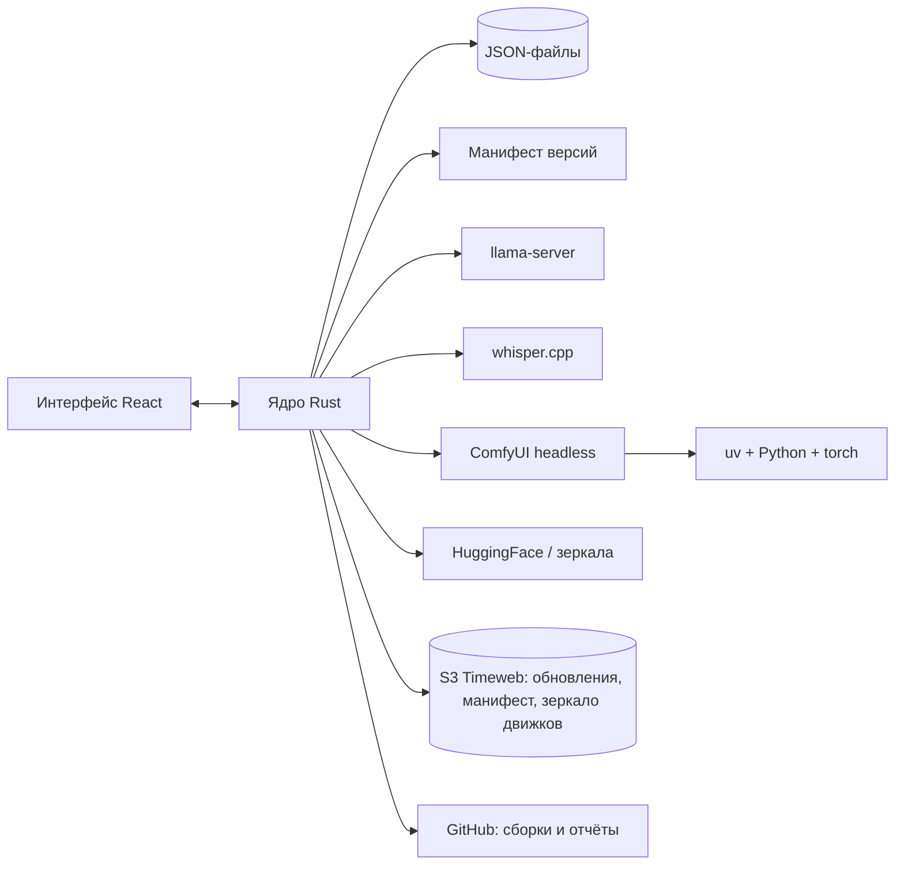

# План: от нуля до версии 1.0

Цель 1.0: **Ollivo** — программа для Windows + NVIDIA, которую ставит человек без технических знаний.
Внутри: чат с локальными моделями, голос, файлы, картинки, видео и звук, простой режим и режим «Профи».

Сроки — ориентир для одного разработчика, а не обещание. Первая оценка (2026-09-21)
была 7–10 месяцев; фазы 0–3 заняли 6 дней, поэтому 2026-09-26 план пересчитан под реальный темп.

## Стек
| Часть | Что берём | Почему |
|---|---|---|
| Оболочка | Tauri 2 + React + TypeScript | Лёгкий установщик (~10 МБ против ~150 у Electron), нативное окно |
| Ядро | Rust (внутри Tauri) | Скачивание, манифест, запуск движков, проверка железа. Работает ещё до того, как появился Python |
| Хранилище | JSON-файлы (SQLite — если понадобится) | Чаты, библиотека моделей, настройки. Разговоров сотни, поиск перебором — 0,2 с на 23 МБ ([Фаза 2](phase-2.md)) |
| Текст и зрение | llama.cpp (`llama-server`), готовая сборка: Vulkan по умолчанию, CUDA — ускоритель по замеру ([Фаза 0](phase-0.md)) | Без Python, API как у OpenAI, стриминг |
| Картинки и видео | ComfyUI headless (через его API) | Поддерживает почти все модели, граф можно открыть в «Профи» |
| Голос в текст | whisper.cpp на процессоре, модель small | Без Python; сборки под видеокарту для Windows непригодны ([Фаза 3](phase-3.md)) |
| Текст в голос | Piper / Silero / Kokoro — выбор по замеру на русском в фазе 6 | Лёгкие, работают на процессоре |
| Python-окружение | uv + встроенный Python 3.12 | Только для ComfyUI и того, что без Python не работает |
| Железо | NVML (крейт `nvml-wrapper`) | Модель видеокарты, видеопамять, версия драйвера |
| Установщик | NSIS через бандлер Tauri | Стандартно, без прав администратора |
| Обновления | Tauri updater + `latest.json` в S3 (Timeweb) | Как в ClipVault («Монетизация и релиз ClipVault» (личная заметка, вне репозитория)) |
| Сборки и отчёты | GitHub Releases и Issues, с 0.1 | Тестеры — знакомые и незнакомые люди; отчёт уходит одной кнопкой из программы |

**Смена решения:** раньше планировали Python-сайдкар на FastAPI как главный бэкенд.
Теперь главный бэкенд — Rust-ядро: логика установки не может жить в Python, которого ещё нет.
Python — лишь один из движков, и ставится он по требованию.

## Схема

```mermaid
flowchart LR
  UI[Интерфейс React] <--> Core[Ядро Rust]
  Core --> DB[(JSON-файлы)]
  Core --> M[Манифест версий]
  Core --> L[llama-server]
  Core --> W[whisper.cpp]
  Core --> C[ComfyUI headless]
  C --> Py[uv + Python + torch]
  Core --> HF[HuggingFace / зеркала]
  Core --> S3[(S3 Timeweb: обновления, манифест, зеркало движков)]
  Core --> GH[GitHub: сборки и отчёты]
```

## Обновления и распространение
Схема как в ClipVault и десктопе Призмы Права: всё лежит в S3 Timeweb, публичное чтение.
```
<bucket>/ollivo/
  updates/latest.json        версия, заметки, URL, подпись — заливается ПОСЛЕДНИМ
  updates/<ver>/…setup.exe   установщик + .sig
  manifest/engines.json      проверенные версии движков, URL, SHA256
  manifest/recipes.json      рецепты задач (фаза 5), подписанные
  mirror/…                   зеркало небольших движков (llama.cpp, whisper.cpp, uv, ffmpeg)
```
- **Программа:** Tauri updater проверяет `latest.json` при запуске и раз в сутки. Файлы подписаны ключом Tauri updater
  (бесплатно, не связано с SmartScreen): подменённое обновление программа не установит.
- **Движки и рецепты** обновляются отдельно от программы, через манифест. Подборка моделей — встроенная и в S3 не выносится:
  люди сами качают модели, какие хотят и откуда хотят, и подключают к программе (решение 2026-09-27).
- **Зеркало движков** в S3 спасает, когда GitHub медленный или недоступен. torch (~3 ГБ) и модели не зеркалим — дорого по трафику;
  они идут с PyPI/PyTorch и HuggingFace, у HF — запасное зеркало.
- **Скрипт `publish-update`:** сборка → подпись → заливка установщика → `latest.json` последним ([RELEASE.md](../RELEASE.md)).
- **Каналы:** `stable` и `beta` (отдельный `latest-beta.json`), бета-тестеры включают в настройках.
- **GitHub Releases** в публичном `WufCorp/Ollivo` — страница загрузки с SHA256 для тех, кто ставит впервые,
  и запасной адрес автообновления (с 0.1.0): S3 не ответил — программа берёт `latest.json` из последнего выпуска;
  отчёты — issues там же.
- Ключ подписи updater и ключи S3 хранятся вне репозитория; в заметках — только имена переменных.

### Без подписи кода (SmartScreen)
Сертификата пока нет, поэтому новичок увидит «Windows защитил ваш компьютер». Что делаем:
- На сайте и в README рядом с кнопкой «Скачать» — картинка-инструкция: «Подробнее → Выполнить в любом случае».
- Публикуем SHA256 установщика; перед каждым релизом проверяем его на VirusTotal.
- Ложные срабатывания Defender отправляем в Microsoft через бесплатную форму проверки файлов.
- Не используем упаковщики exe: они сильно повышают риск ложных срабатываний.
- Обновления, которые скачивает сама программа, обычно проходят без окна SmartScreen: предупреждение появляется только при первой установке.
- Репутация у SmartScreen копится со скачиваниями, и со временем предупреждение может пропасть само.
- **Решено (2026-09-26):** подпись берём у SignPath Foundation (бесплатно для open source). Репозиторий уже публичный,
  но файла LICENSE нет — юридически это «все права защищены», и SignPath такой проект не примет. Не хватает
  лицензии (OSI) и CONTRIBUTING. Заявку рассматривают неделями, поэтому лицензию — не позже 0.9, чтобы 1.0 вышла подписанной;
  раньше — можно, код и так виден.

## Фаза 0. Разведка рисков — закрыта ([Фаза 0](phase-0.md))
- [x] `uv` сам ставит Python, venv и torch с CUDA: venv 5,2 ГБ, torch лучше качать своим загрузчиком.
- [x] `llama-server` из готовой сборки запускается и стримит ответ; Vulkan — по умолчанию, CUDA 13 не работает на Pascal.
- [x] ComfyUI из zip запускается headless и генерирует картинку по API (workflow в JSON).
- [x] Тип модели по файлу: GGUF и заголовок safetensors (LLM / SD1.5 / SDXL / Flux / видео / Whisper / TTS).
- [x] Расчёт «пойдёт ли модель» — «светофор», коэффициенты откалиброваны на SD 1.5 и SDXL.
- [x] Название: **Ollivo**, сайт ollivo.ru.
- [x] Кириллица и пробелы в путях — автотесты в вехе 0.1.
- [ ] Откалибровать Flux GGUF и видео (Wan 1.3B) — в фазах 4 и 6.

## Фаза 1. Каркас и установка — закрыта ([Фаза 1](phase-1.md))
- [x] Проект Tauri + React, CI на GitHub Actions (тесты и установщик, ~17 минут).
- [x] Менеджер загрузок: докачка, SHA256, повторы, зеркала, пауза, 8 потоков.
- [x] Манифест движков (встроен, выигрывает бо́льший `revision`).
- [x] Мастер первого запуска: проверка ПК, выбор диска, сеть, движок (VC++ с 0.1 кладётся рядом с движком).
- [x] Экран установки: шаги, время словами, пауза, автоповтор, прогресс на панели задач.
- [x] Менеджер процессов движков: Job Object, логи в файл, ожидание готовности.
- [x] Кнопка «Починить».
- [x] Автообновление: S3, ключ updater, `publish-update`, каналы; 0.0.1 → 0.0.2 проверено вживую.
- [x] UAC в мастере больше нет (0.1): библиотеки VC++ кладутся рядом с движком.

## Фаза 2. Чат с текстовыми моделями — закрыта ([Фаза 2](phase-2.md))
- [x] Библиотека моделей: добавить файл (кнопка или перетаскивание), тип и светофор определяются сами.
- [x] Подхват моделей из папок LM Studio, Ollama и ComfyUI без копирования.
- [x] Каталог: подборка проверенных моделей + поиск по HuggingFace, прогноз скорости до скачивания.
- [x] Автонастройка запуска: слои на видеокарту, размер контекста.
- [x] Чат: стриминг, markdown и код, остановка, перегенерация, история, поиск по чатам.
- [x] Пресеты вместо параметров: «Точнее · Обычно · Креативнее», роли.
- [x] Понятные ошибки с кнопками действий.
- [x] Лицензия модели в карточке.
- [x] Проверено в окне 2026-09-26.

## Фаза 3. Голос и файлы — закрыта, кроме зеркала ffmpeg ([Фаза 3](phase-3.md))
- [x] Диктовка: кнопка микрофона → whisper.cpp → текст в поле ввода.
- [x] Вложения: картинки для моделей со зрением (mmproj подключается сам, докачивается по просьбе).
- [x] Документы: PDF, DOCX, ODT, TXT, код → текст в разговор; длинный — предупредить и приложить начало.
- [x] Аудиофайл → расшифровка (MP3, WAV, OGG, FLAC; через ffmpeg — M4A, OPUS, видео).
- [x] Папка проекта: модель читает, ищет, правит и удаляет файлы; режимы «Вручную · Авто · План»; «Вернуть как было».
- Остальное — в вехе 0.1.

## Веха 0.1 — первая публичная сборка (чат, голос, файлы)
**Готово, когда** человек скачивает сборку с GitHub, ставит её, переписывается
с моделью, прикладывает PDF, фото и голос и может одной кнопкой сообщить о проблеме.
Ориентир — 4–7 дней.

**Закрыть фазу 3**
- [x] Проверить в окне (2026-09-26/27): документы скрепкой и «Приложить только начало», картинки, «докачать зрение»,
  замену модели без зрения, записи MP3/M4A/OGG и установку ffmpeg, карточки «поправить» и «удалить», диктовку.
  Не проверены: перетаскивание файла в окно, HEIC/AVIF и видео.
- [x] WebP и TIFF — перекодировать самим (крейт `image`), фото с телефона — повернуть по EXIF.
- [x] ffmpeg по требованию, как whisper (`engines.json`, 7z 35 МБ): через него M4A, AAC, OPUS, голосовые Telegram,
  звук из видео и картинки HEIC, AVIF (кодеков HEIF в Windows по умолчанию нет). Осталось зеркало в S3.
- [x] Модель не видит картинку — предложить свою модель со зрением или подходящую из подборки, скачать и переключиться
  одной кнопкой (`vision_offer`, 2026-09-26). Карточка проверена в окне, сама загрузка — нет. Остальные файлы понимает любая модель: документы — текст,
  записи расшифровывает whisper.
- Выбор «точнее» (turbo) для записей — в 0.2, не блокирует.

**Кнопка «Сообщить о проблеме»** (раньше стояла в фазе 8: без неё публичные сборки не дадут отчётов)
Сделано 2026-09-26, проверено в окне — [Веха 0.1](v0.1.md).
- [x] Ядро собирает отчёт: версия, железо, сборки движков, хвосты логов, последние ошибки `trouble.rs`,
  настройки без секретов. Переписку не собирает, имя пользователя в путях → `%USERNAME%`.
- [x] Человек видит, что уйдёт, и сам нажимает «Отправить».
- [x] В 0.1 — форма issue на GitHub с заголовком и кратким текстом, полный отчёт — текстовым файлом (не zip:
  его можно открыть Блокнотом). Минус — нужен аккаунт GitHub; к 0.5 решить, нужен ли свой приёмник без аккаунта
  (функция на Timeweb → S3 → issue ботом).
- [x] Кнопка — в «Настройках», на карточке ошибки («Не помогло — сообщить») и под ошибкой установки.
- [x] Шаблоны issue: «Не ставится», «Модель не запускается», «Другое»; сразу спрашивают видеокарту.
- [x] Метки в репозитории — workflow `labels.yml` из `.github/labels.tsv`; шаблоны форм GitHub принял (2026-09-27).

**Обязательные настройки ⭐** ([Настройки](settings.md))
- [x] Папка программы с переносом на другой диск; сколько занято; «Очистить кэш и недокачанное». Проверено в окне на тестовой папке.
- [x] Выгружать модель через N минут простоя (по умолчанию 10); просыпается сама на вопросе. Проверено в окне.
- [x] Тема: тёмная / светлая, своя, а не как в Windows (с 2026-09-27). Проверено в окне.
- [x] Обновления: автоматически / спрашивать; канал stable / beta — было с фазы 1.
- [x] «Приватность» прямым текстом; «Сбросить настройки». Проверено в окне.

**Надёжность установки**
- [x] Кириллица и пробелы в путях, работа без системного VC++ — автотесты на настоящих движках (`llm::tests::real_human_paths`, `speech::tests::real_human_paths`, 2026-09-27). Нашли и исправили: whisper падал, если в пути к модели кириллица.
- [x] DLL VC++ рядом с движком — UAC больше не нужен (2026-09-27, [Веха 0.1](v0.1.md)).

**Перед публикацией**
- [x] История репозитория проверена на секреты 2026-09-26 (52 коммита, шаблоны gitleaks: ключи AWS/HF/GitHub/OpenAI, закрытые ключи, пароли в коде, строки с высокой энтропией) — чисто; нашлась только открытая часть ключа подписи обновлений, ей там и место.
- [x] gitleaks в CI на каждый push (2026-09-26, v8.30.1 со сверкой SHA256, вся история) — чтобы секрет не попал в публичный репозиторий и дальше.
- [x] Безопасность: свой CSP, права окна урезаны до нужного, ревью ядра (2026-09-27) — [Веха 0.1](v0.1.md).
- [x] Сайт-одностраничник в `site/`, выкладка на GitHub Pages (2026-09-27) — [Сайт](site.md). Осталось включить Pages и домен.
- [x] Выпуск 0.1.0 (2026-09-27): S3 beta и stable, GitHub Release с SHA256 и `latest.json` (запасной адрес обновлений), в README и на странице выпуска — инструкция про SmartScreen. Подпись проверена тестом по всем трём адресам. VirusTotal не делали — на сайте об этом не обещаем, SHA256 опубликован.
- [ ] Раздать 5–10 знакомым и выложить публично.

## Постоянно после 0.1 — цикл отчётов
- Раз в несколько дней разбирать issues и выпускать 0.x.y через автообновление.
- Матрица железа — `docs/hardware.md`: видеокарта / драйвер / сборка / скорость / что сломалось, по отчётам.
  Главный вопрос к ней — **Vulkan или CUDA на RTX**: от ответа зависит сборка по умолчанию.
- Каждая найденная ошибка — новый образец в `trouble.rs` и тест.

## Фаза 4. Картинки → версия 0.5, открытая бета
**Готово, когда** новичок генерирует картинку, не зная слов «сэмплер» и «CFG». Ориентир — 2–3 недели.
- [x] Установка по требованию (ядро, 2026-09-27, [Фаза 4](phase-4.md)): uv + Python 3.12 без venv, torch своим
  загрузчиком (GTX 10xx → cu126, RTX → cu130), ComfyUI закреплённой версией из `engines.json`, без веб-интерфейса,
  прокси из настроек. ~8 минут без скачивания torch, окружение 4,7 ГБ.
- [ ] Экран установки картинок (`InstallScreen`) и «Починить», пересоздающее окружение.
- [x] Ядро `comfy.rs` (2026-09-27): headless в Job Object, задачи через `/prompt`, прогресс по websocket,
  результат — файлы из `/history`. SD 1.5 512² — 8,6 с.
- [ ] Общая видеопамять: перед генерацией модель чата выгружается, потом возвращается. Решает ядро.
- [ ] Шаблоны workflow: SD 1.5, SDXL, Flux, SD 3.5 — выбираются по типу модели. Flux GGUF требует custom node
  ComfyUI-GGUF: на нём проверить, ставятся ли custom nodes без интерфейса. Откалибровать «светофор» на Flux.
- [ ] Каталог картинок: проверенные модели с хешами. `.ckpt`/`.pt` — предупредить и предложить safetensors.
- [ ] Экран «Картинки»: описание, форма (квадрат, портрет, пейзаж), «Быстро ↔ Качественно», сколько вариантов, время до старта.
- [ ] Галерея: параметры в PNG; «Повторить», «Вариации», «Доработать» (картинка → картинка), «Дорисовать» (маска кистью), «Открыть папку».
- [ ] Общая очередь задач и уведомления Windows — ею же пользуются видео и записи.
- [ ] Строки интерфейса — в словарь (каркас i18n, пока только RU): сейчас это дешевле, чем в фазе 8.
- [ ] Роспатент (Ollivo / Olivo / Оливо), простая страница на ollivo.ru.

## Фаза 5. Задачи и умный чат → 0.6
**Готово, когда** задачу можно решить в один клик с главного экрана, а в чате можно попросить картинку. Ориентир — 1–2 недели.
- [ ] `recipes.json` в S3: входы, модели, движок, workflow, хеши; приезжает по `revision`.
  Рецепт заставляет программу качать файлы — поэтому манифест **подписан**.
- [ ] Главный экран с плитками: «Удалить фон», «Улучшить фото», «Расшифровать запись», «Нарисовать», «Перевести документ»;
  «Озвучить текст» — с фазой 6.
- [ ] Оркестратор в чате: инструмент `generate_image` в том же цикле «модель → инструмент», что у папки проекта;
  правда — из шагов, а не из слов модели.

## Фаза 6. Видео и звук → 0.8
**Готово, когда** можно сделать короткое видео из фото и поговорить с моделью голосом. Ориентир — 3–4 недели.
- [ ] TTS: сначала замер на русском (Piper, Silero, Kokoro) — качество и скорость на процессоре. Чтение ответов вслух, плитка «Озвучить текст».
- [ ] Голосовой режим «как звонок»: определитель речи, whisper кусками, ответ модели, TTS, можно перебить.
- [ ] Видео через ComfyUI (Wan, LTX), калибровка на GTX 1080. Честное время до старта, даже если это «10 минут на 5 секунд».
- [ ] Длинные задачи в фоне: общая очередь, отмена, уведомление, работа из трея.
- [ ] По возможности — музыка и звуки; не успеваем — после 1.0 без ущерба для вехи.

## Фаза 7. Режим «Профи» → 0.9
**Готово, когда** опытный пользователь может заменить программой свой набор ComfyUI + LM Studio. Ориентир — 2 недели.
- [ ] Переключатель режима; в простом режиме ничего лишнего не видно.
- [ ] Все параметры llama.cpp и генерации (`plan` уже принимает ручные числа), свои аргументы запуска.
- [ ] Логи движков в реальном времени, встроенный терминал в окружении программы.
- [ ] Граф ComfyUI в отдельном окне, свои workflow, custom nodes, LoRA.
- [ ] Локальный API в стиле OpenAI: прокси в Rust перед llama-server с переключением моделей;
  ключ — в диспетчере учётных данных, доступ из сети выключен по умолчанию.
- [ ] Версии движков: откат, свои сборки, «Замерить скорость» Vulkan против CUDA.
- [ ] Лицензия и заявка в SignPath (см. фазу 8) — не позже 0.9, ради подписи к 1.0.

## Фаза 8. Полировка и релиз 1.0
**Готово, когда** на 20+ разных ПК (по отчётам) установка проходит без помощи. **→ Версия 1.0.** Ориентир — 2–4 недели,
упирается в отчёты людей, а не в код.
- [ ] Проход по матрице железа; сборка по умолчанию — по замерам.
- [ ] Обновление движков через манифест с откатом, если новая версия не запустилась.
- [ ] Отчёт о сбое: паника или падение движка → при следующем запуске предложить отправить отчёт.
- [ ] Английский язык, включая сообщения `trouble.rs` из ядра.
- [ ] Знакомство при первом запуске, подсказки.
- [ ] Офлайн-установщик: Vulkan-движок и маленькая модель внутри.
- [ ] Открытый проект по-настоящему: лицензия (отдельное решение с причиной), CONTRIBUTING, README для разработчиков, подпись от SignPath Foundation в сборке.
- [ ] Товарный знак РФ, классы 9 и 42. Сайт — дописать по мере фаз (одностраничник с 0.1 — `site/`), документация, видео-демо.
- [ ] Финальная проверка безопасности: CSP, локальный API, границы инструментов модели.

## После 1.0
- AMD (ROCm/Vulkan), Intel, macOS (Apple Silicon).
- Доступ с телефона по Wi-Fi через QR-код.
- Поиск по своим документам и большим проектам (RAG), папки-базы знаний.
- Обмен пресетами и рецептами, плагины.
- Модель монетизации (решить отдельно).

## Сквозное (на каждом выпуске)
- `cargo test` и зелёный CI; настоящие тесты движков (`--ignored`), в том числе с кириллицей в путях; проверка в окне того, что изменилось.
- VirusTotal, SHA256, заметки к версии.
- Приватность: всё работает офлайн, сеть — только для скачивания и отчёта, который человек отправил сам.
- Никаких технических терминов в простом режиме: перед выпуском вычитываем тексты.

## Итог по срокам
| Веха | Что | Примерно |
|---|---|---|
| 0.1 — первая публичная сборка | закрыть фазу 3, отчёты, ⭐ настройки, чистая Windows | 4–7 дней |
| 0.5 — открытая бета | картинки, ComfyUI | +2–3 недели |
| 0.6 | задачи, оркестратор | +1–2 недели |
| 0.8 | TTS, голосовой режим, видео | +3–4 недели |
| 0.9 | «Профи», лицензия и SignPath | +2 недели |
| 1.0 | полировка, EN, 20+ ПК | +2–4 недели |
| **Всего до 1.0** | | **~3–4 месяца** |

Самые рискованные места: установка ComfyUI и custom nodes без интерфейса (фаза 4),
видео на 8 ГБ видеопамяти (фаза 6), русский TTS хорошего качества на процессоре.
